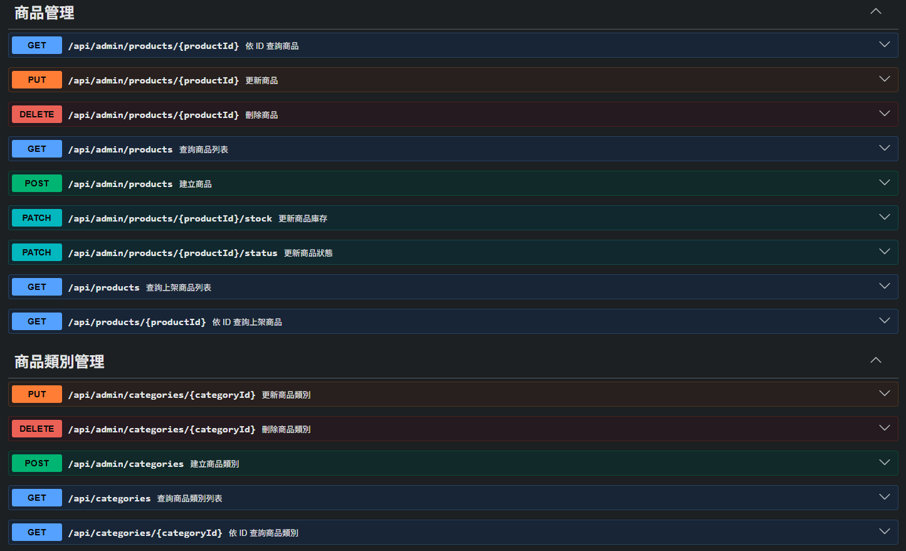
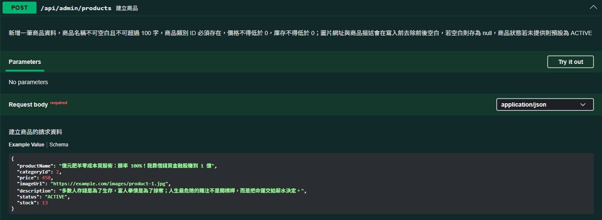
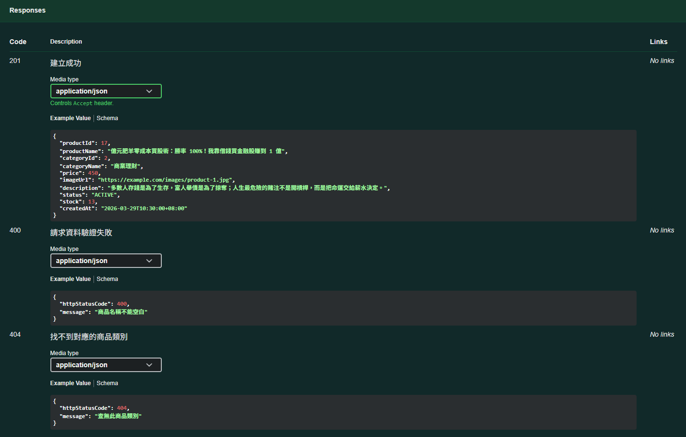

# `Spring Boot Product Management API`

## `Overview`

這是一個使用 Spring Boot 開發的 RESTful API，提供商品與商品類別管理功能。
專案涵蓋商品 / 商品類別 CRUD、請求資料驗證、全域例外處理，以及關鍵字模糊查詢、條件篩選、分頁與排序功能，並使用 Swagger / OpenAPI 產生 API 文件，方便進行 API 測試與展示。

## `Features`

### `Category`

- 商品類別 CRUD
- 商品類別名稱模糊查詢
- 商品類別分頁查詢

### `Product`

- 商品 CRUD
- 商品名稱模糊查詢
- 商品條件篩選
- 商品分頁與排序

### `Common`

- Bean Validation 請求資料驗證
- Global Exception Handler 統一錯誤回應格式
- Swagger / OpenAPI API 文件

## `Tech Stack`

- Java 17
- Spring Boot 4.0.3
- Spring Web
- Spring Data JPA
- Bean Validation
- PostgreSQL
- Maven
- Swagger / OpenAPI
- Lombok

## `Project Structure`

```
src/  
└─ main/  
	├─ java/  
	│ ├─ controller/ # API 端點
	│ ├─ service/ # 商業邏輯
	│ ├─ repository/ # 資料存取
	│ ├─ dto/
	│ │ ├─ request/ # 請求 DTO
	│ │ └─ response/ # 回應 DTO
	│ ├─ entity/ # JPA Entity
	│ ├─ enums/ # 列舉型別
	│ └─ exception/ # 例外處理
	└─ resources/
		└─ sql/
			├─ schema.sql
			├─ data.sql
			└─ migrations/
```

## `API Documentation`

專案啟動後，可透過以下路徑查看 Swagger UI :

`http://localhost:8080/swagger-ui/index.html`

以下為 Swagger UI 畫面部分截圖 :

### `Swagger UI Overview`



### `API Example`




## `Getting Started`

### `Prerequisites`

- Java 17  
- Maven  
- PostgreSQL

### `Database`

請先建立 PostgreSQL 資料庫，並在 `application.properties` 中設定資料庫連線資訊。

專案內附以下 SQL 腳本，供建立資料表與初始化測試資料使用 :

- `src\main\resources\sql\schema.sql` : 建立資料表結構
- `src\main\resources\sql\data.sql` : 初始化測試資料

開發過程中的 SQL 調整紀錄保留於 `src/main/resources/sql/migrations/`。

### `Run`

#### `Windows` :

```
mvnw.cmd spring-boot:run
```

#### `macOS / Linux` :

```
./mvnw spring-boot:run
```

## `Future Goals`

下一階段預計加入 Spring Security，實作登入功能與權限管理，讓專案更貼近實際後端應用情境。
之後也希望逐步擴充更多電商相關功能，例如購物車、訂單、會員與付款流程，最終完成一個較完整的電商網站。
